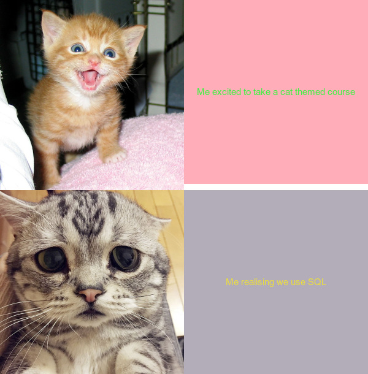

# My Meme
>  The **newness** and **originality** of this meme may be debatable. 
However, when we ignore the format and cat theme, this meme drills down into my own personal experiences and fears.

_What could be more original that that?_





* You may notice a jarring yellow and grey combination when next to the distraught cat, recognising that they must revist SQL. I did this so that my dislike towards queries, was structured in language, and a gross colo**u**r. 

* Pink and green is my favourite colo**u**r combination, so naturally I had to use this for the text beside my excited cat. 

# My R Code

When making this meme, it was very important that I had [{magick}](https://cran.r-project.org/web/packages/magick/vignettes/intro.html) installed in my R studio.

Some of the motivations behind this meme i made were:
1. I once had to learn SQL over zoom and couldn't access it on my computer for various technical issues, naturally I am now very scared of this acronym
2. I like cats
3. I dont like the colo**u**r yellow
4. I like pink and green combined 😎


#### Please see my R code below 

```r
library("magick")
Linking to ImageMagick 6.9.12.3
Enabled features: cairo, fontconfig, freetype, heic, lcms, pango, raw, rsvg, webp
Disabled features: fftw, ghostscript, x11
importing images for my mem
> excited_cat <- image_read("https://static.boredpanda.com/blog/wp-content/uploads/2015/07/smiling-cat-19__605.jpg")
> %>% image_scale(300)
Error: unexpected SPECIAL in "%>%"
> image_read ("https://static.boredpanda.com/blog/wp-content/uploads/2015/07/smiling-cat-19__605.jpg")
  format width height colorspace matte filesize density
1   JPEG   605    625       sRGB FALSE   136328   72x72
> excited_cat <- image_read("https://static.boredpanda.com/blog/wp-content/uploads/2015/07/smiling-cat-19__605.jpg")
> excited_cat %>% image_scale(300)
  format width height colorspace matte filesize density
1   JPEG   300    310       sRGB FALSE        0   72x72
> distraught_cat <- image_read("https://static.boredpanda.com/blog/wp-content/uploads/2017/09/saddest-cat-luhu-maggie-liu-lanlan731-38-59c0bfed09657__700.jpg") %>% image_scale (300)
 excited_text <- image_blank(300,300,color="#ffaeb9")
> 
> excited_text %>% image_annotate (text = "me excited to take a cat themed course", 
+                                  color = "#2a293d",
+                                  size = 15,
+                                  font = "Roboto Mono",
+                                  gravity = "center")
  format width height colorspace matte filesize density
1    png   300    300       sRGB  TRUE        0   72x72
> distraught_text <- image_blank(300,300,color = "#B3ACB9")
distraught_text %>% image_annotate(text = "Me realsiing I have to use SQL",
+                                    color = "#e9dc43",
+                                    size = 15,
+                                    font = 'Roboto Mono',
+                                    gravity = "Center")
  format width height colorspace matte filesize density
1    png   300    300       sRGB  TRUE        0   72x72
> editedDT <- distraught_text %>% image_annotate(text = "Me realising we use SQL",
+                                                color = "#e9dc43",
+                                                size = 15,
+                                                font = "Roboto Mono",
+                                                gravity = "center")
> editedDT
  format width height colorspace matte filesize density
1    png   300    300       sRGB  TRUE        0   72x72
> editedET <- excited_text %>% image_annotate(text = "Me excited to take a cat themed course",
+                                             color = "#3CF33F",
+                                             size = 15,
+                                             font = "Roboto Mono",
+                                             gravity = "Center")
 #joining my thingies
> face_vector <- c(excited_cat, distraught_cat)
> image_append (face_vector, stack = TRUE)
  format width height colorspace matte filesize density
1   JPEG   605    925       sRGB FALSE        0   72x72
> excited_cat %>% image_scale (300)
  format width height colorspace matte filesize density
1   JPEG   300    310       sRGB FALSE        0   72x72
> distraught_cat %>% image_scale (300)
format width height colorspace matte filesize density
1   JPEG   300    300       sRGB FALSE        0 300x300
 format width height colorspace matte filesize density
1   JPEG   905    925       sRGB  TRUE        0   72x72
> Sexcited_cat <- excited_cat %>% image_scale (300)
> first_row <- c(Sexcited_cat,editedET) %>% 
+     image_append()
> c(first_row, second_row) %>% 
+     image_append(stack = TRUE)
  format width height colorspace matte filesize density
1   JPEG   600    610       sRGB  TRUE        0   72x72
> my_meme <- c(first_row, second_row) %>% 
+     image_append(stack = TRUE)
> my_meme 
  format width height colorspace matte filesize density
1   JPEG   600    610       sRGB  TRUE        0   72x72
> image_write(my_meme,"laura's_meme.png")
> laura's_meme
```
